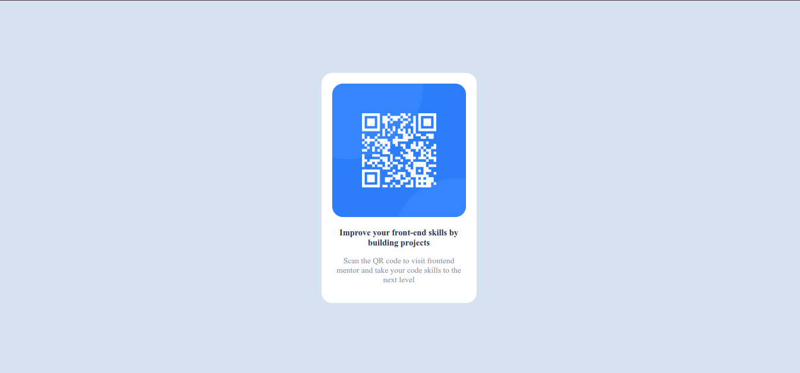

# Frontend Mentor - QR code component solution

This is a solution to the [QR code component challenge on Frontend Mentor](https://www.frontendmentor.io/challenges/qr-code-component-iux_sIO_H).

## Table of contents

- [Overview](#overview)
  - [Screenshot](#screenshot)
  - [Links](#links)
- [My process](#my-process)
  - [Built with](#built-with)
  - [What I learned](#what-i-learned)
  - [Continued development](#continued-development)
  - [Useful resources](#useful-resources)
- [Author](#author)

## Overview

### Screenshot



### Links

- Solution URL:()
- Live Site URL:()

## My process

### Built with

- Semantic HTML5 markup
- CSS custom properties

### What I learned

used to center a div without using flex-box or grid

```css
.wrapper {
  position: absolute;
  inset: 0;
  margin: auto;
}
```

### Continued development

css positioning

### Useful resources

https://youtu.be/ULVu2VNM_54

## Author

- [@judgetoworld]
